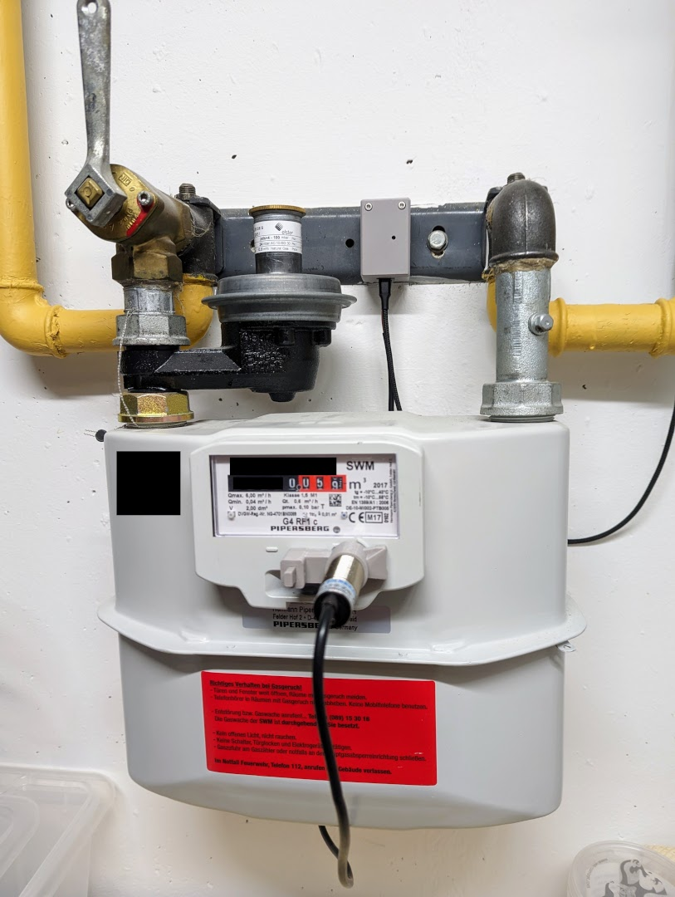
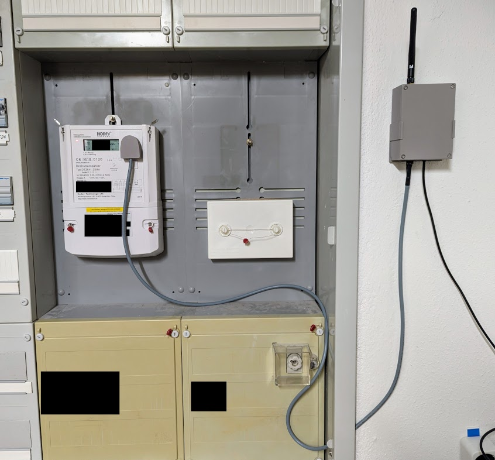
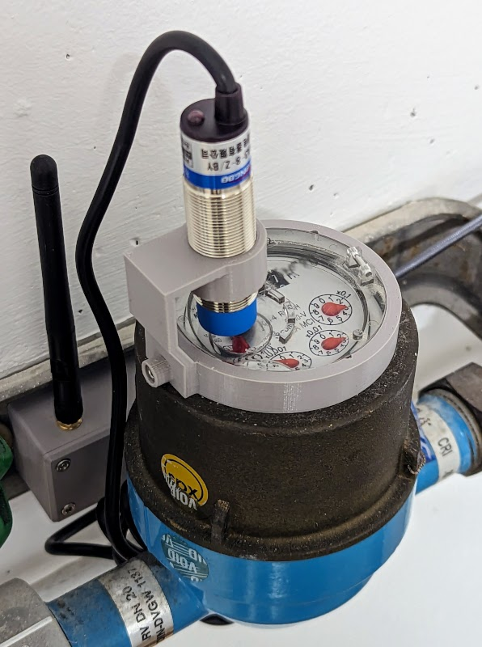

ESPHome Household Meter Configurations
======================================

These are ESPHome configurations and custom code I use to read out my
household meters (electricity, gas, water). Chances are you can use some of
them for your house, but equally likely you may have different devices or need
some customization. In either case, maybe these files can serve as a useful
example.

  
  
  

