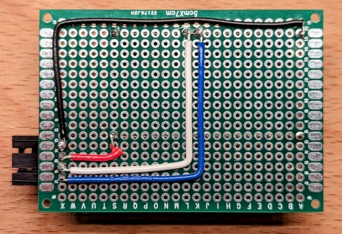
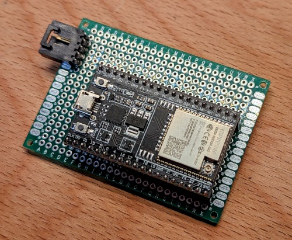

Holley DTZ541-ZEBA Power Meter
==============================

The Holley DTZ541-ZEBA is a common power meter in Germany. It provides data
via a standardized optical infrared connection. You can use the typical devices
in the market tha texpose the received data via UART. This is meant to be used
with an ESP32 DevKitC board, I'm personally using one with an external antenna
for which I have created a
[custom ESP32 DevKitC case](https://www.printables.com/model/454784-esp32-devkitc-case-with-wifi-antenna).
I have also customized the
[magnetic IR head mount for the DTZ541](https://www.printables.com/model/454299-dtz541-power-meter-magnetic-mount).
If I were to do it again, I'd probably go for a D1 Mini pro
([case](https://www.printables.com/model/466033-esp8266-d1-mini-pro-case-with-external-antenna-and)).

The specific variant and version matters. I found that I could not use the
standard SML module in ESPHome to read the meter data, since it would only
send truncated messages (missing checksum and end marker). So I wrote some
custom to read out the meter. It is based on the standard documentation, some
info from libsml, and Tasmota. It uses a similar pattern matching approach to
Tasmota.

I found this not to work with the DTZ541-ZDBA (two tarriff counter).

  

Board Layout
------------
The following photos show the used wiring. This really is about having headers
to hold the ESP32 DevKitc board and a 4 pin connector for the IR head.

  

  

ESP01-1M Configuration
----------------------
You can get the IR head also with an integrated ESP01-1M. I have tried that
configuration. It works in principal, but I found two problems: the flash
storage is too small for direct upgrades, you always need to flash a minimal
image and only then the actual image. And second wifi reception can be pretty
bad. The power meter tends to be enclosed by a metal casing rendering this
option useless unless you have the wifi AP right next to it (maybe).

I have added my YAML file from that experiment and I have also designed a
[custom magentic holder for the IR head with an ESP01](https://www.printables.com/model/454754-dtz541-ir-head-magnet-mount-esp01).

  

