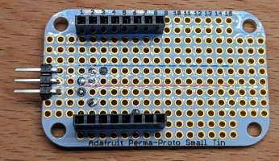
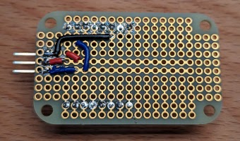

Water Meter via Inductive Sensor
================================

This is an ESPHome configuration to read out a water meter using an inductive
sensor. Water meters like the Diehl Corona MCI come with a metal cog that can
be detected with such a sensor.

In my setup I'm using an Abilkeen LJ18A3-8-Z/BY (PNP, normally open) mounted
with a [custom holder](https://www.printables.com/model/465845-inductive-sensor-holder-for-diehl-corona-mci).
This configuration still needs some tweaking as I'm sometimes still getting
bounce reads.
I use an ESP8266 based D1 Mini Pro in a
[magnet-held case](https://www.printables.com/model/466033-esp8266-d1-mini-pro-case-with-external-antenna-and).

This configuration uses only built-in ESPHome capabilities.

  

Board Schematic
---------------

Here is a simple schematic of the board layout I used. No active components,
just wiring up the connector. I have used a angled pin header soldered into
the second row of holes.

  

  
  

